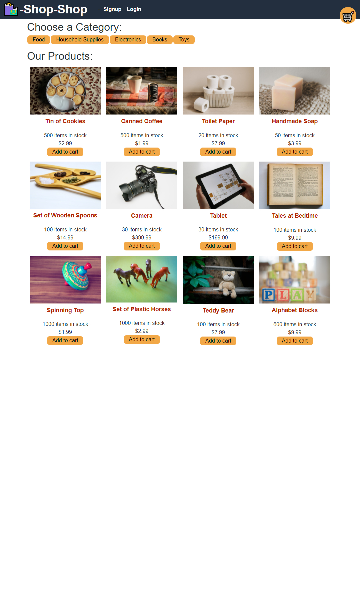
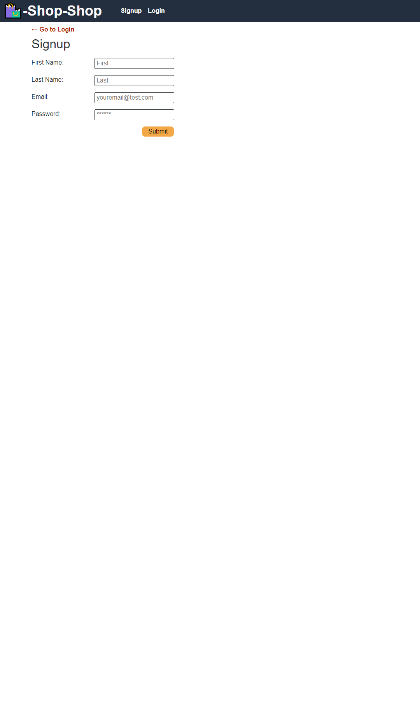
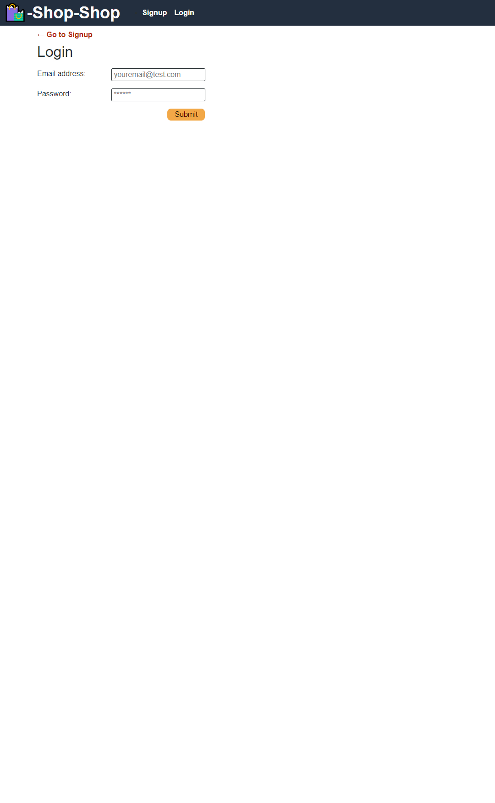
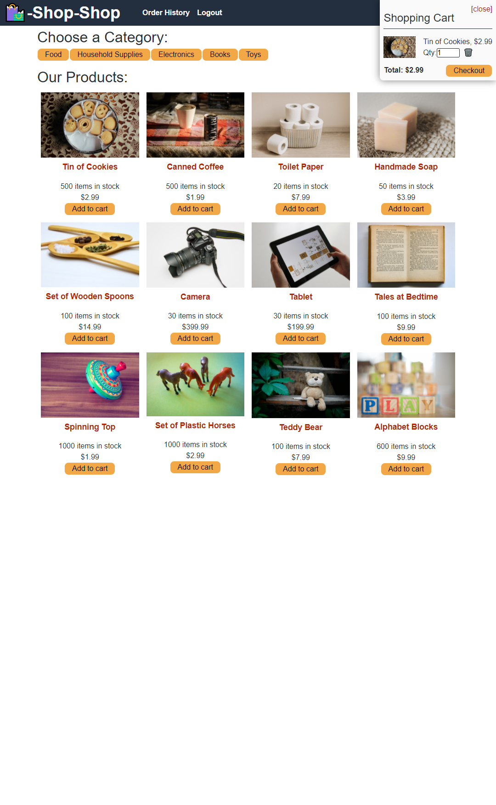
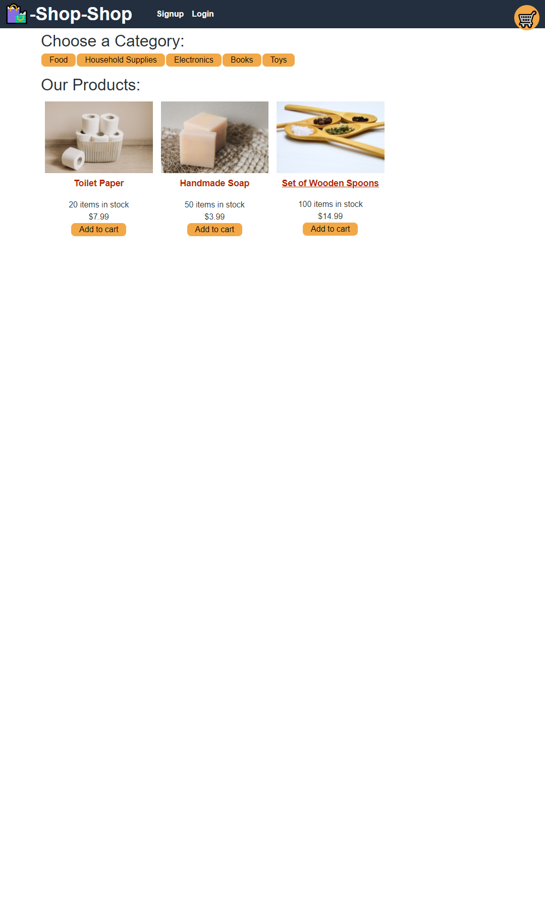
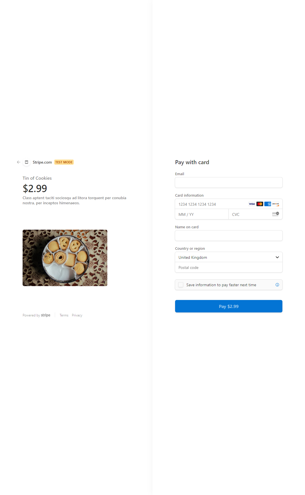

# redux-store


## Table of Contents

- [redux-store](#redux-store)
  - [Table of Contents](#table-of-contents)
  - [deployed url](#deployed-url)
  - [Description](#description)
  - [Installation](#installation)
  - [Usage](#usage)
  - [License](#license)
  - [Contributing](#contributing)
  - [Tests](#tests)
  - [screenshots](#screenshots)

## deployed url

https://murmuring-fjord-28863.herokuapp.com/

## Description

I've been tasked with making a E-commerce store using Redux.

## Installation

```
git clone git@github.com:Cratesy/redux-store.git
cd redux-store
npm install
```

## Usage

```
As a user i am greeted by the homepage which had all products on. I can also click one of the category tabs to filter the products to display only the one that was clicked.
as a user i can add items to my cart which gets stored and then i must be logged in to go to checkout and pay.
as a user i can sign-up, once ive signed up it automatically logs me in.
as a user i can log in if im not already logged in, session expires after 2hrs.
As a user when your logged in you can see your order history on purchases you've made.
as a user i can logout.
```

## License

[MIT License](https://opensource.org/licenses/MIT)

## Contributing

[Mike](https://github.com/Cratesy)

## Tests

None were need

## screenshots








```

```
